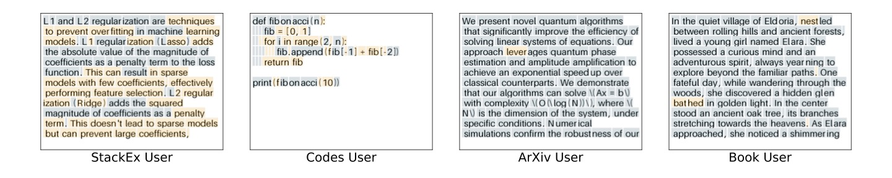

# On-Device Collaborative Language Modeling via a Mixture of Generalists and Specialists

This is the code base for [On-Device Collaborative Language Modeling via a Mixture of Generalists and Specialists](https://arxiv.org/abs/2409.13931)

  

We propose a novel **Co**llaborative learning approach with a **Mi**xture of **G**eneralists and **S**pecialists (CoMiGS), which successfully addresses both system heterogeneity and data heterogeneity on device. As in the following plot, we follow a MoE architecture, while letting the experts diversify into generalists and specialists via parameter aggregation or localization, to leverage both collective power and specialized knowledge. A key innovation of our method is the bi-level optimization formulation
of the Mixture-of-Experts learning objective, which follows the hierarchical order and router and experts learning. 

  

Our method achieves the finest-grained balance of personalizetion and collaboration, as witnessed by the Top1 expert choice from the 1st and last layer. (Orange - generalist, blue - Specialist)

  

  

## Methods implemented

Our code repository is built up on [nanoGPT](https://github.com/karpathy/nanoGPT) and [nanoGPT-LoRA](https://github.com/danielgrittner/nanoGPT-LoRA/blob/master/model.py). We implement the following baselines:
- Local Fine-Tuning
- FedAvg Fine-Tuning
- [FlexLoRA](https://arxiv.org/abs/2402.11505) by Jiamu Bai et al. 
- [HetLoRA](https://arxiv.org/abs/2401.06432) by Yae Jee Cho et al.
- [FFA-LoRA](https://arxiv.org/abs/2403.12313) by Youbang Sun et al. 
- Strategy 2 of [PCL](https://arxiv.org/abs/2404.09753) by Nicolas Wagner et al. 
- An adapted version of [pFedMoE](https://arxiv.org/abs/2402.01350) by Liping Yi et al.
- Our CoMiGS method 

### Structure
`Collab_runscripts` contains the experiment configurations used for the experiments in the paper. These serve as examples on how to configure the runs for `collab_run.py` experiments. 

New methods can be implemented by extending `collab_utils/collaborations_strategies.py` and `collab_utils/aggregation_strategies.py`.
